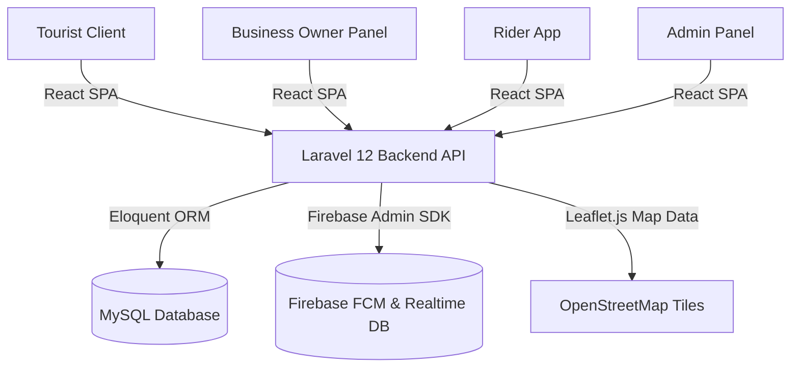

# TrackTour — Bansud Tourism Management Portal

TrackTour is a multi-role tourism management platform built with a **Laravel 12** API backend and a **React 19** SPA frontend. The system serves five user roles: **Tourist**, **Business Owner**, **Rider**, **Staff**, and **Bansud Tourism Office/Admin**.

It provides an end-to-end digital travel experience for exploring destinations, booking accommodations, ordering local foods, hiring transportation, and navigating with real-time geographic map tracking.

---

## 🏗️ System Architecture

The application is structured as a decoupled web application utilizing Laravel as a robust API backend (authenticated via Laravel Sanctum tokens) and React as a dynamic Single Page Application (SPA) frontend.



### Technical Stack

| Layer | Technology | Description |
|-------|------------|-------------|
| **Backend** | [Laravel 12](https://laravel.com) (PHP 8.2) | Handles business logic, notifications, security, and RESTful APIs. |
| **Frontend** | [React 19](https://react.dev), [Vite 8](https://vite.dev) | Renders dynamic dashboards and user interaction interfaces. |
| **Styling** | [Tailwind CSS 4](https://tailwindcss.com) | Provides rapid utility-first UI styling. |
| **Database** | MySQL (via XAMPP) | Persists user data, order records, bookings, and logs. |
| **Auth** | Laravel Sanctum | Handles API-based token issuance and secure sessions. |
| **Real-time** | Firebase Cloud Messaging (FCM) & Realtime DB | Syncs rider locations, sends push notifications, and hosts chat messages. |
| **Maps** | Leaflet.js | Implements interactive GIS map marking, distance calculation, and routing. |

---

## 👥 Roles & Core Features

### 1. 🏝️ Tourist
The traveler's portal for browsing and consuming local tourism services.
- **Location-Based Discovery:** Browse nearby attractions, resorts, restaurants, and active transport providers.
- **Resort & Hotel Booking:** Browse room capacities, select dates, supply guest details, and book reservations.
- **Food Ordering:** Cart management, delivery/pickup checkouts, real-time status tracking, and orders feedback.
- **Rider Booking:** Book local tricycles or motorcycles with upfront fare estimation and live route tracking.
- **Interactive Map:** Leaflet map overlay of spots, resorts, restaurants, and active riders.
- **Messaging:** Real-time chat with riders or business owners.

### 2. 💼 Business Owner
Management panel for local businesses and services.
- **Multi-Step Registration Wizard:** Persists session progress, uploads required legal documents (DTI/SEC, Mayor's Permit), and manages the media gallery.
- **Offering CRUD:** Full management of products, services, menus, and featured promotions.
- **Order & Booking Workflows:** Calendar grids for accommodation bookings, status transitions for orders, and rider assignments.
- **Analytics & Reports:** Detailed CSV/PDF exportable dashboards tracking sales, booking logs, and staff productivity.

### 3. 🏍️ Rider
The logistics and transport provider companion application.
- **Status Toggling:** Switch service mode between food delivery and transport service (tricycle/motorcycle).
- **Dispatch Queue:** Accept or decline incoming ride requests or food delivery jobs within a 60-second window.
- **Live GPS Tracking:** Push current coordinates to the Firebase Realtime Database.
- **Trip Navigation:** Live routing from pickup location to target destination.

### 4. 🧑‍💼 Staff
Granular portal for merchant employees.
- **Order Pipeline:** Receive, prepare, pack, and release food orders.
- **Booking Pipeline:** Confirm, reject, or mark hotel/resort check-ins.
- **Permissions:** Restricted permissions mapped via the [RolePermission](file:///C:/xampp/htdocs/Capstone%20Project%201/app/Models/RolePermission.php) model.

### 5. 🏛️ Admin (Bansud Tourism Office) & Tourism Office
Platform moderation and live operations.
- **KYC & Account Approvals:** Review and approve business owners, verify document authenticity, and manage user statuses.
- **Live Operations Dashboard:** Map tracking active deliveries, tour guides, and SOS emergency requests.
- **System Backups:** Native SQL dump/restore schedules.

---

## 📁 Repository Structure

The project code is divided into backend (Laravel framework files at the root) and frontend (React SPA files in the `frontend` folder).

### Backend Structure
- [app/Console/Commands/](file:///C:/xampp/htdocs/Capstone%20Project%201/app/Console/Commands) — Automated Artisan commands (e.g. location log cleanups).
- [app/Enums/](file:///C:/xampp/htdocs/Capstone%20Project%201/app/Enums) — Shared domain statuses (`GuideStatus.php`, `PriceRange.php`, `TripStatus.php`).
- [app/Http/Controllers/](file:///C:/xampp/htdocs/Capstone%20Project%201/app/Http/Controllers) — RESTful API controllers grouped by roles (Admin, Api, Auth, Rider, Tourist, BusinessOwner).
- [app/Http/Middleware/](file:///C:/xampp/htdocs/Capstone%20Project%201/app/Http/Middleware) — Custom routing guards (`CheckRole.php`, `CheckAccountStatus.php`, `StaffMiddleware.php`).
- [app/Models/](file:///C:/xampp/htdocs/Capstone%20Project%201/app/Models) — 43 active Eloquent models representing the database schema.
- [app/Services/](file:///C:/xampp/htdocs/Capstone%20Project%201/app/Services) — Core services powering matching, geo-calculations, dispatch, and the Socket.IO realtime bridge.
- [database/migrations/](file:///C:/xampp/htdocs/Capstone%20Project%201/database/migrations) — 85+ database migrations establishing the structural schema.
- [routes/api.php](file:///C:/xampp/htdocs/Capstone%20Project%201/routes/api.php) — Primary route definition containing 100+ endpoints.

### Frontend Structure
- [frontend/src/components/](file:///C:/xampp/htdocs/Capstone%20Project%201/frontend/src/components) — Reusable components (e.g. app cards, chat widgets, tracking maps).
- [frontend/src/pages/](file:///C:/xampp/htdocs/Capstone%20Project%201/frontend/src/pages) — Views layout segregated by role workflows.
- [frontend/src/services/](file:///C:/xampp/htdocs/Capstone%20Project%201/frontend/src/services) — Api endpoints wrapper clients.
- [frontend/src/context/](file:///C:/xampp/htdocs/Capstone%20Project%201/frontend/src/context) — Auth context, Cart stores, and realtime socket listeners.

---

## ⚡ Core Algorithms & Services

### 1. `NearestRiderService`
Located at [NearestRiderService.php](file:///C:/xampp/htdocs/Capstone%20Project%201/app/Services/NearestRiderService.php), this service calculates the nearest available riders relative to a booking pickup location:
- Computes distances using the **Haversine formula** (`6371 * ACOS(...)`).
- Resolves candidates from local MySQL rider state (`rider_details` + `rider_locations`); the old Firebase Realtime Database mirror was removed (see ADR 003), so MySQL is the only candidate source.
- dispatches delivery jobs in sequence. If a rider fails to respond within the `DISPATCH_TIMEOUT_SECONDS` (60s), the service automatically attempts to dispatch to the next nearest rider.

### 2. `TransportationService`
Located at [TransportationService.php](file:///C:/xampp/htdocs/Capstone%20Project%201/app/Services/TransportationService.php), this service handles transport bookings:
- Calculates fare pricing details based on vehicle type (Motorcycle, Tricycle, Car, Van) using base fare rates and rates per kilometer.
- Generates a unique 4-digit verification PIN (`ride_pin`) for tourist security.

### 3. `WebsocketNotifierService`
Located at [WebsocketNotifierService.php](file:///C:/xampp/htdocs/Capstone%20Project%201/app/Services/WebsocketNotifierService.php), this service bridges Laravel events with the self-hosted Socket.IO server:
- Emits dispatch pings, assignment, cancellation, and status events to authorized rooms over the internal HTTP bridge.
- MySQL/Laravel stays authoritative; the socket layer only transports events.

> **Removed:** `FirebaseService` (Firebase Realtime Database mirrors for rider status, dispatch requests, chat, and trip tracking) was deleted in favour of MySQL + Socket.IO — see `docs/decisions/003-websocket-not-firebase.md`.

---

## ⚙️ Development & Installation Setup

### Prerequisites
Ensure you have the following installed on your system:
- PHP >= 8.2
- Composer
- Node.js & NPM
- XAMPP (with MySQL database)

### Setup Steps

1. **Clone the project & enter directory:**
   ```bash
   git clone <repository-url>
   cd "Capstone Project 1"
   ```

2. **Configure environment credentials:**
   ```bash
   copy .env.example .env
   ```
   *Edit the `.env` file to provide database connections, application URL, and Firebase configuration details.*

3. **Install dependencies & build resources:**
   The project is equipped with a custom composer script to automate configuration:
   ```bash
   composer run setup
   ```
   This script triggers `composer install`, sets up your `.env`, runs `key:generate`, triggers migrations (`migrate --force`), runs `npm install`, and builds front-end production bundles.

4. **Run Development Server:**
   Start all components concurrently (Laravel server, background queue, Pail log listeners, and Vite development server) using the custom command:
   ```bash
   composer run dev
   ```
   This will spin up:
   - **Laravel API:** `http://127.0.0.1:8000` (optional — the frontend does **not** use it)
   - **Vite Bundler:** `http://localhost:3000`
   - **Background Queue Listener:** To handle async notifications.
   - **Laravel Pail:** To stream error/debug output in real-time.

   > **Frontend API path:** the browser calls `/api` **relative to `localhost:3000`**; Vite proxies it to **XAMPP Apache** (`http://localhost/Capstone%20Project%201/public`), not to `:8000`. See `frontend/vite.config.ts` (the stale `vite.config.js` duplicate, which still pointed at `:8000`, was deleted on 2026-09-23). Apache must be running, otherwise API calls fail with `502`.
   >
   > **Do not "fix" slowness with `PHP_CLI_SERVER_WORKERS`** — on Windows the PHP built-in server ignores it (worker forking needs `fork()`), and it is single-threaded (~0.87 req/s), which was the root cause of false "Unable to change availability right now." errors.

---

## 🧪 Testing

The repository contains tests using PHPUnit for unit/feature tests and Selenium WebDriver for UI integration testing:
- **Run local unit tests:**
  ```bash
  composer run test
  ```
- **UI Integration Tests:**
  Selenium workflows testing business owner registration, forgot password pages, and staff management are stored in [tests/Selenium/](file:///C:/xampp/htdocs/Capstone%20Project%201/tests/Selenium).

---

## 📄 Reference Documentation

For more in-depth reviews, consult the specific documents under the `/docs` directory:
- [docs/PROGRESS.md](file:///C:/xampp/htdocs/Capstone%20Project%201/docs/PROGRESS.md) — Feature status checklist, tables metrics, and historical logs.
- [docs/DESIGN_SYSTEM.md](file:///C:/xampp/htdocs/Capstone%20Project%201/docs/DESIGN_SYSTEM.md) — Color themes, UI guidelines, cards styling, and fonts.
- [docs/tourist-dashboard.md](file:///C:/xampp/htdocs/Capstone%20Project%201/docs/tourist-dashboard.md) — Specifications regarding the tourist booking, discovery, maps, and tracking details.
