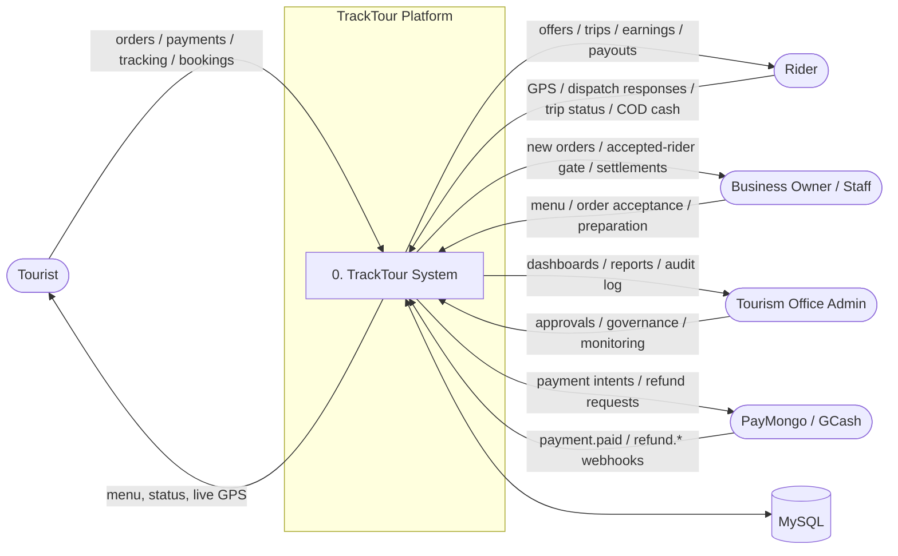
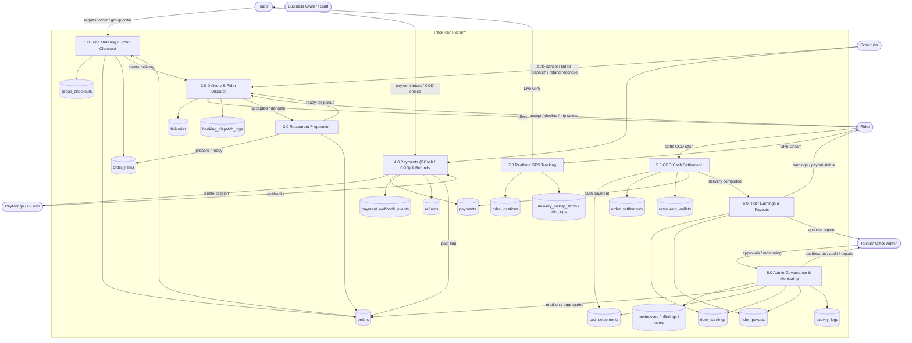
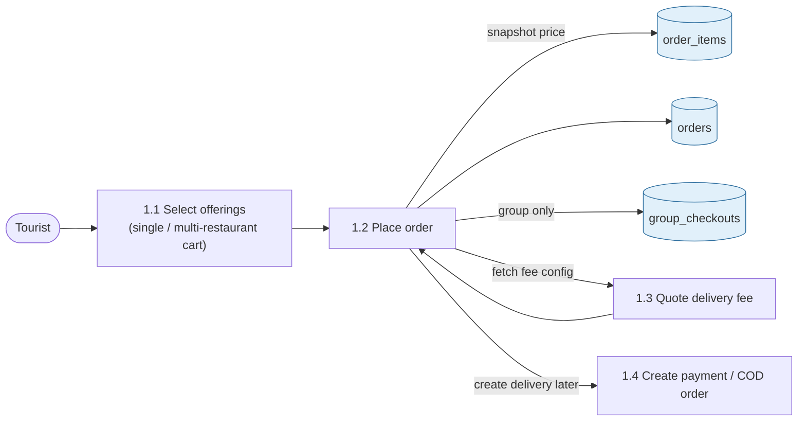
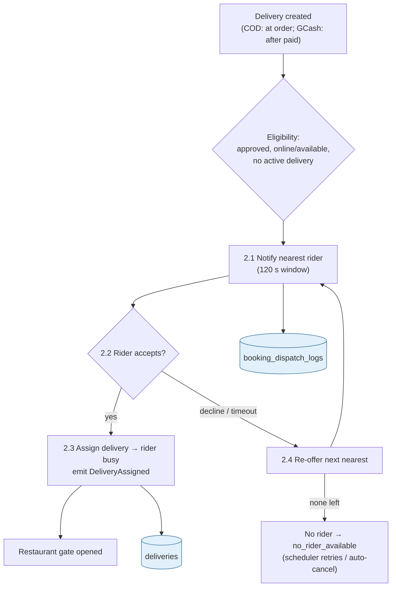
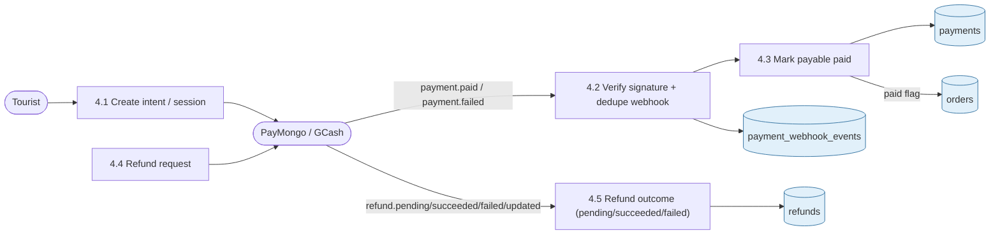
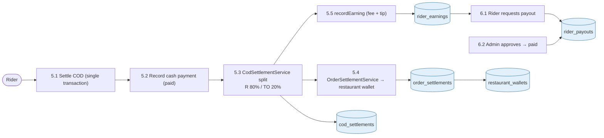

# TrackTour — Data Flow Diagram (DFD)

> Current as of the post-dispatch-reliability checkpoint (2026-09-23).
> Sources: `routes/api.php`, `app/Services/*`, models in `app/Models`, `docs/architecture/*`.

Mermaid notation: rounded boxes = processes, cylinders `[( )]` = data stores,
boxes = external entities, arrow labels = data flows.

---

## 1. Context Diagram (DFD Level 0)

The system boundary is the **TrackTour platform** (Laravel API + React frontend + Socket.IO bridge).
MySQL is the trusted store; PayMongo is the only third-party authority for payment/refund outcomes.

---

## 2. Level 1 DFD — Major Processes

---

## 3. Level 2 — Key Process Details

### 3.1 Ordering & Group Checkout (`1.0`)

One `group_checkouts` → one canonical `orders` → N `order_items` (each tagged with `business_id`)
→ one `deliveries` → one rider. Never an `orders` row per restaurant.

### 3.2 Delivery Dispatch & Rider Acceptance (`2.0`)

Dispatch by distance/eligibility via `SmartDispatchService` → `NearestRiderService`.
Acceptance is atomic (row locks + one-active-delivery DB guard). Restaurant preparation is
**gated** until `deliveries.rider_id` is set.

### 3.3 Payment & Refund Outcomes (`4.0`)

Outcomes are **provider-authoritative** and idempotent via
`payment_webhook_events.provider_event_id` UNIQUE. No state downgrades.

### 3.4 COD Settlement, Earnings & Payouts (`5.0` / `6.0`)

COD is credit-free (no rider wallet). Rider keeps the cash. 80/20 split booked from
`order.rider_financed_amount` once per order. Earnings = delivery fee + tip only.

---

## 4. Data Store Map

| Store | Contents | Invariants |
|---|---|---|
| `group_checkouts` | Group totals, payment status | one per group order |
| `orders` | Canonical order + financial columns | `deliveries.order_id` UNIQUE |
| `order_items` | Items carrying `business_id`, status, timestamps | per-item prep status |
| `deliveries` | Trip lifecycle, dispatch state, `rider_id` | UNIQUE per order / per group |
| `booking_dispatch_logs` | Offer lifecycle per delivery+rider | TTL 120 s, next-rider re-offer |
| `payments` | Morph payable, method, provider, status | provider ref UNIQUE; no downgrades |
| `payment_webhook_events` | Idempotency backstop | `provider_event_id` UNIQUE |
| `refunds` | Refund ledger | `provider_refund_id` UNIQUE |
| `cod_settlements` | One 80/20 split per order | `order_id` UNIQUE |
| `order_settlements` | Common earning settlement | `order_id` UNIQUE |
| `restaurant_wallets` + txn | Business earning ledger | `business_id` UNIQUE; immutable txns |
| `rider_earnings` | Fee + tip per delivery | UNIQUE (rider, order, status) |
| `rider_payouts` + pivot | Payout lifecycle | one live payout per rider; earning once |
| `rider_locations` / `trip_logs` | GPS checkpoints, polyline | integrity-bounded updates |
| `activity_logs` | Admin audit trail | append-only |
| `businesses` / `offerings` / `users` | Catalog + actors + roles/approvals | approvals govern access |